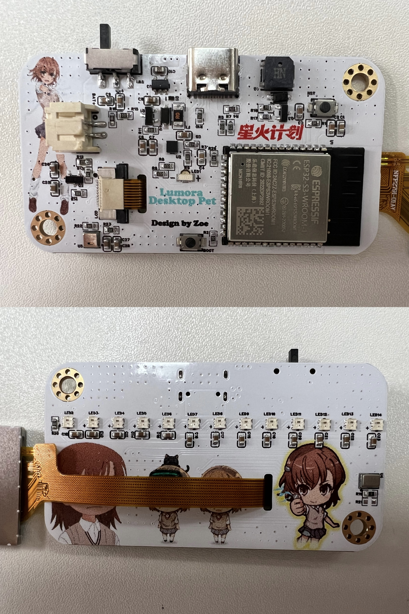

# OmiPet

OmiPet 是一个面向陪伴场景的桌面宠物相关的软硬件项目。仓库按功能划分目录，固件、硬件资料和 3D 文件分别独立管理。

## 项目目录

```text
OmiPet/
├─ Firmware/       # ESP32-S3 固件（PlatformIO + Arduino）
├─ Hardware/       # 硬件设计资料
│  ├─ Schematic/   # 原理图 PDF
│  ├─ Images/      # 硬件实物照片
│  └─ Enclosure/   # 3D 外壳模型
├─ 3D/             # 3D 模型、结构设计文件（后续添加）
├─ README.md
└─ .gitignore
```

## 固件

固件位于 `Firmware/`，当前使用：

- PlatformIO
- Espressif32
- Arduino framework
- ESP32-S3 DevKitC-1

进入固件目录后编译：

```powershell
cd Firmware
pio run
```

编译产物位于 `Firmware/.pio/`，该目录已加入 Git 忽略规则，不会提交到仓库。

## 硬件资料

当前已归档原理图：`Hardware/Schematic/Omi_Schematic.pdf`。

### 焊接完成照片

以下为更新后的焊接完成实物照片（2026-09-30）。



### 3D 外壳文件

- [`Frontcover.STEP`](Hardware/Enclosure/Frontcover.STEP)：前壳模型
- [`Backcover.STEP`](Hardware/Enclosure/Backcover.STEP)：后壳模型

Git 不会跟踪空目录；`Hardware/PCB/`、`Hardware/BOM/` 和 `3D/` 等目录将在加入实际文件后显示在仓库中。

## 当前注意事项

`Firmware/platformio.ini` 中配置了 16MB Flash 和 PSRAM。

### 温湿度传感器补偿说明

AHT20 上电初期的温度和湿度读数基本接近环境值。随着 ESP32-S3 主控、LCD 背光、电源区域和灯带持续工作，传感器所在 PCB 区域会逐渐升温，导致 AHT20 测到的局部温度高于实际环境温度；由于相对湿度会随温度变化，温度升高时湿度读数也会相应偏低。因此，设备运行一段时间后会出现温度逐渐偏高、湿度逐渐偏低的现象。

由于当前 PCB 无法重新布局或增加热隔离结构，固件暂时按照整机稳定运行后的实测结果加入经验补偿：温度减去约 `4 °C`，湿度增加约 `9 %RH`。该补偿不是 AHT20 厂家提供的固定参数，只适用于当前传感器安装位置、主控负载、LCD 背光、灯带亮度、供电方式和外壳状态；如果这些条件发生变化，需要重新进行现场校准。设备上电后应等待一段时间，待内部温度稳定后再以显示值作为环境温湿度参考。

## 提交规范

请勿提交以下内容：

- PlatformIO 构建目录和生成的临时文件
- VS Code 本地配置及用户路径
- 本地环境变量、密码、Token、私钥和证书
- 串口日志、调试转储和个人临时文件

相关规则见根目录 `.gitignore`。
